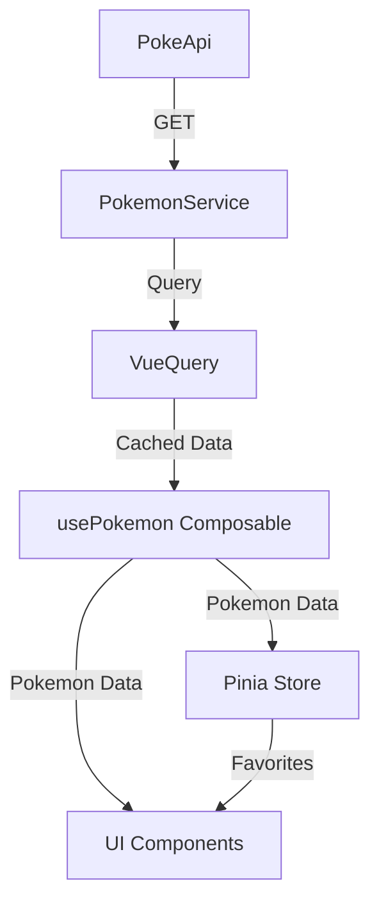
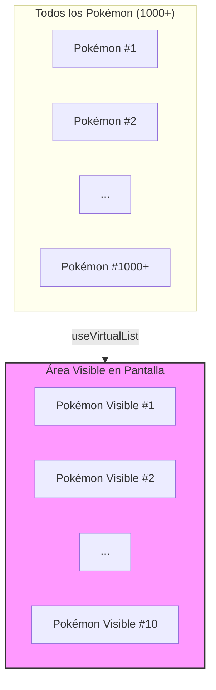
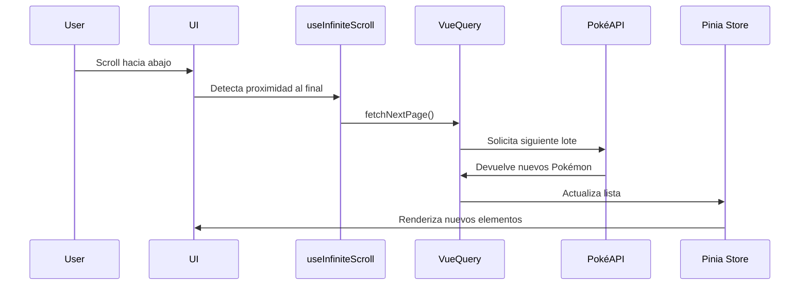
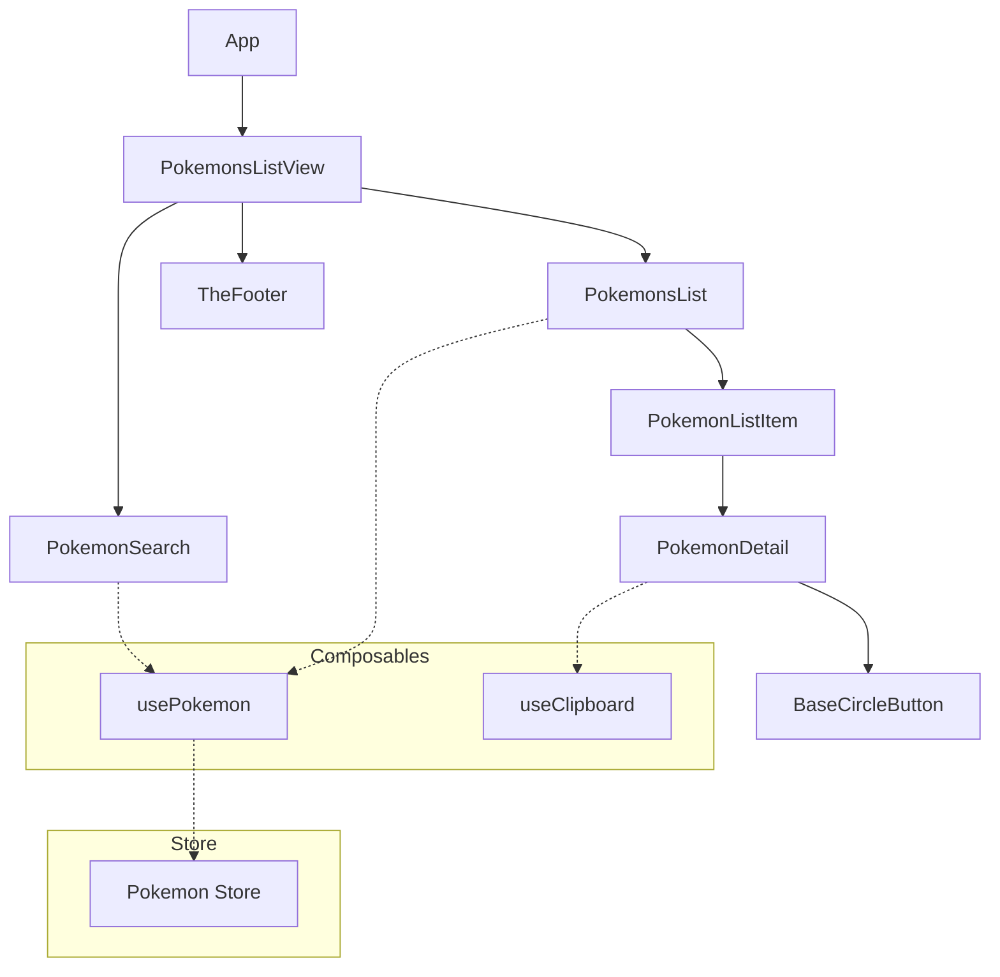

## Enfoque y visión general

Al enfrentarme a este proyecto, mi objetivo principal fue crear una aplicación que no solo fuera visualmente atractiva, sino también técnicamente robusta y escalable. Aunque la aplicación puede parecer sencilla a primera vista, implementé soluciones pensando en el manejo de grandes volúmenes de datos.

## Arquitectura y organización


Opté por una arquitectura modular con una clara separación de responsabilidades:

- **Composables personalizados**: Creé `usePokemon.ts` para encapsular toda la lógica relacionada con los Pokémon, separando la UI de la lógica de negocio. Esto facilitaría la mantenibilidad y testabilidad del código.

- **Pinia para el estado global**: Utilicé Pinia en lugar de Vuex por su mejor integración con TypeScript y una API más moderna. El store mantiene y persiste la lista de Pokémon favoritos, permitiendo un acceso consistente desde cualquier componente.

## Rendimiento con grandes volúmenes de datos

Para manejar eficientemente grandes cantidades de datos, implementé:

- **Lista virtualizada**: Utilicé `useVirtualList` de VueUse, que renderiza únicamente los elementos visibles en pantalla. Esto es crucial cuando se trabaja con listas extensas, como los potenciales 1000+ Pokémon, ya que evita la sobrecarga del DOM y mantiene la aplicación fluida.
## Lista virtualizada
## Lista virtualizada



## Scroll infinito
- **Scroll infinito**: Implementé `useInfiniteScroll` para cargar datos adicionales a medida que el usuario se acerca al final de la lista. En lugar de cargar todos los Pokémon de una vez (lo que sería ineficiente), estos se cargan por lotes, mejorando significativamente los tiempos de carga inicial.
## TanStack Query
- **TanStack Query (Vue Query)**: Para gestionar las peticiones a la API de forma eficiente, con funcionalidades como caché, reintento de peticiones fallidas y estados de carga/error.


## Estructura de componentes

## Optimizaciones de UX

- **Debounce en búsquedas**: Implementé un debounce en el campo de búsqueda para evitar múltiples llamadas a la API mientras el usuario está escribiendo.

- **Toast notifications**: Para confirmar acciones como agregar a favoritos o compartir información.

- **Modal detallado**: Para mostrar información detallada de cada Pokémon sin perder el contexto de la lista.

## Herramientas y utilidades

- **VueUse**: Esta librería fue fundamental por sus composables reutilizables que aceleraron el desarrollo. Además de `useVirtualList` y `useInfiniteScroll`, utilicé `useClipboard` para la funcionalidad de compartir y `useDebounceFn` para la búsqueda.

- **TypeScript**: Implementé interfaces claras para los datos, lo que facilita el mantenimiento y previene errores.

## Testing

Agregué una suite de tests unitarios con Vitest para validar el funcionamiento correcto de componentes clave y la lógica del negocio.

## Reflexión

Aunque la aplicación podría haberse implementado de forma más sencilla, elegí un enfoque más robusto pensando en la escalabilidad. Las decisiones técnicas fueron tomadas considerando:

1. La posibilidad de expansión (más Pokémon, más funcionalidades)
2. El rendimiento con grandes volúmenes de datos
3. La experiencia de usuario
4. La mantenibilidad del código

Esta arquitectura asegura que la aplicación funcione de manera fluida incluso si la base de datos crece significativamente, manteniendo tiempos de carga rápidos y una experiencia de usuario óptima.

## Customize configuration

See [Vite Configuration Reference](https://vitejs.dev/config/).

## Project Setup

```sh
npm install
```

### Compile and Hot-Reload for Development

```sh
npm run dev
```

### Type-Check, Compile and Minify for Production

```sh
npm run build
```

### Run Unit Tests with [Vitest](https://vitest.dev/)

```sh
npm run test:unit
```

